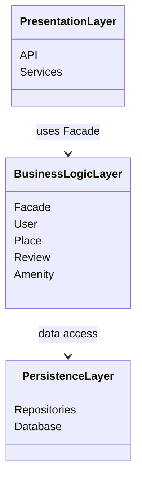
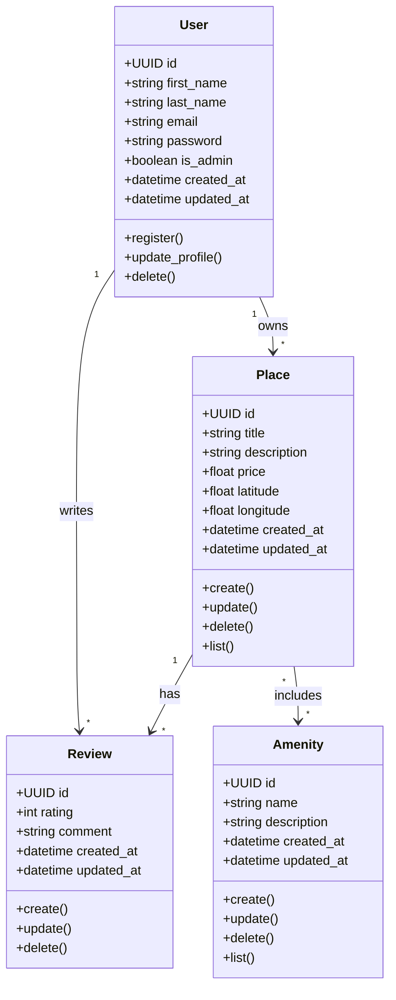
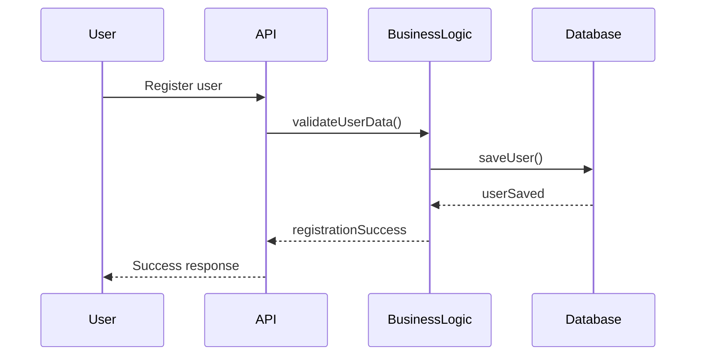
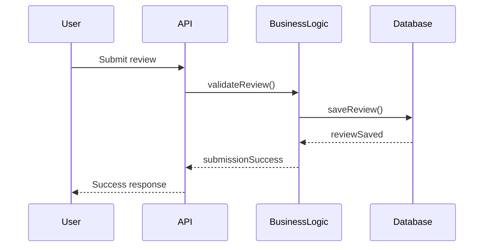
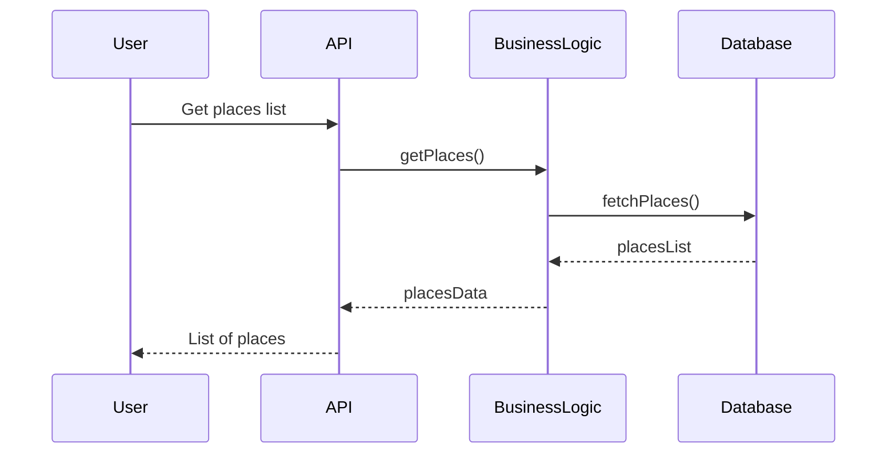

# HBnB Evolution – Technical Documentation

## 1. Introduction

HBnB Evolution is a simplified AirBnB-like application designed to manage **users, properties (places), reviews, and amenities**.  
This document provides a comprehensive overview of the application’s **architecture, business logic, and API interaction flows**.  

It serves as a reference and blueprint for the implementation phases, ensuring that developers understand the system design and relationships between components.

---

## 2. High-Level Architecture

### Layered Architecture Overview

The application follows a **three-layer architecture**:

1. **Presentation Layer:** Handles user interaction via APIs and services. Does not contain business logic.  
2. **Business Logic Layer:** Contains core domain models and the **Facade**, centralizing application logic.  
3. **Persistence Layer:** Responsible for data storage and retrieval.  

**The Facade Pattern** provides a single interface for the Presentation Layer to communicate with the Business Logic Layer, promoting **loose coupling** and maintainability.

### High-Level Package Diagram

**Explanation:**

- Shows the three layers and their interactions.
- Presentation Layer communicates with Business Logic via **Facade**.
- Business Logic Layer interacts with the database for all persistence operations.

---

## 3. Business Logic Layer – Class Diagram

### Detailed Class Diagram

**Explanation:**

- Defines core business entities and their attributes/methods.
- UUID ensures unique identification; `created_at` and `updated_at` provide an audit trail.
- Relationships: Users own Places and write Reviews; Places have Reviews and Amenities.

---

## 4. API Interaction Flow – Sequence Diagrams

### User Registration

**Explanation:**

- Flow of a user registration request.
- Data is validated in Business Logic, saved to the database, then confirmed to the user.

### Place Creation

**Explanation:**

- User submits a new property listing.
- Business Logic validates and saves the place in the database, then confirms to the API.

### Review Submission

**Explanation:**

- User submits a review for a place.
- Business Logic ensures the review is linked to the correct user and place before saving.

### Fetching a List of Places

**Explanation:**
- User requests a list of places.
- Business Logic queries the database and returns results via the API.

This technical document provides a **complete overview of HBnB Evolution**:
- High-Level Architecture: Layered structure and Facade pattern.
- Business Logic Layer: Core entities, attributes, methods, and relationships.
- API Flows: Step-by-step interaction for key API calls.

It serves as a reference and blueprint for implementation, ensuring clarity and consistency in the project.