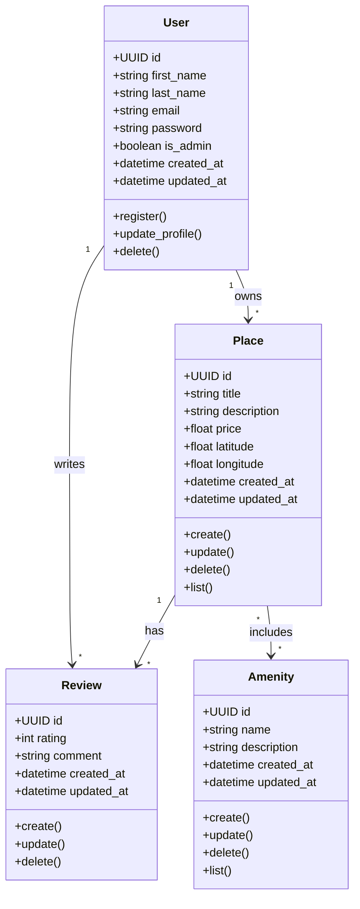

# Business Logic Layer – Class Diagram

- This class diagram represents the core bussines entities of the HBnB application. It defines their attributes, methods, and relationships, providing a clear view of the bussiness logic layer.