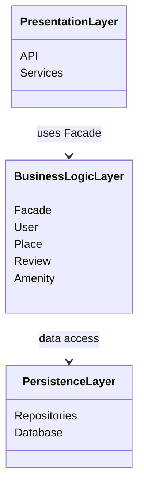

# High-Level Package Diagram

### Layer Responsibilities

- Presentation Layer: Handles user interaction through APIs and services. It does not contain business logic.
- Business Logic Layer: Contains the core application logic and domain models. The Facade provides a unified interface for the Presentation Layer.
- Persistence Layer: Manages data storage and retrieval from the database.

### Facade Pattern Explanation

The Facade pattern simplifies communication between layers by providing a single entry point to the business logic, ensuring loose coupling and better maintainability.

This diagram provides a high-level overview of the system architecture.