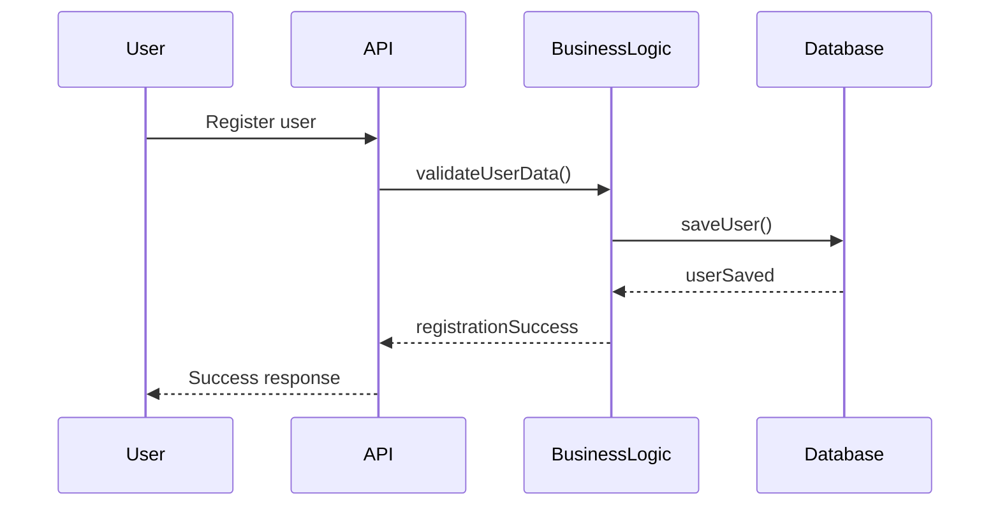
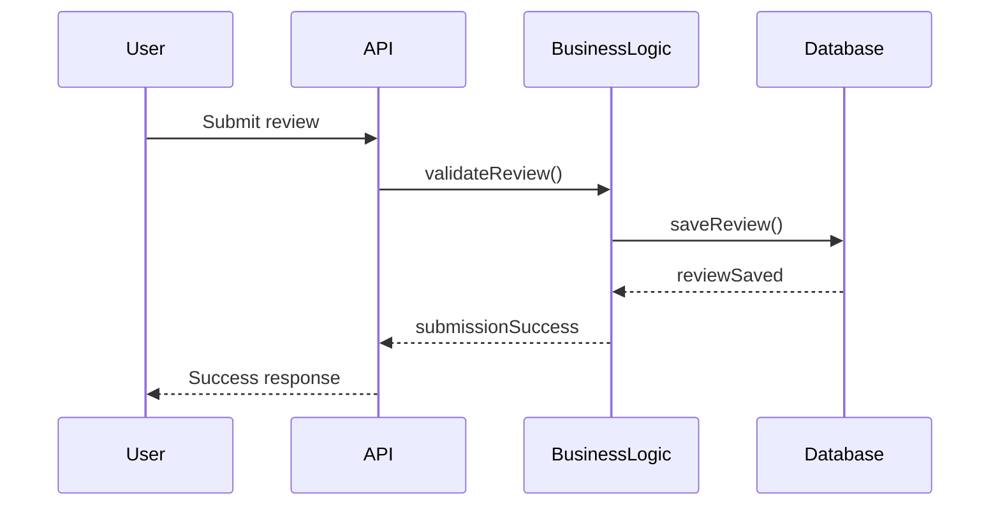
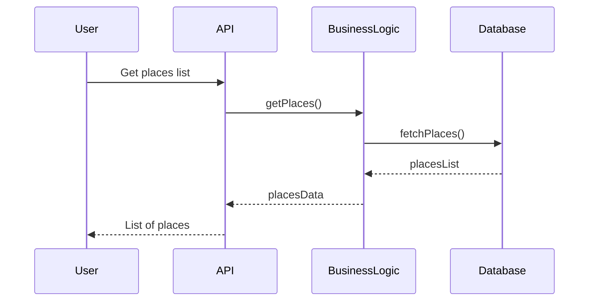

# Sequence Diagram - HBnB Evolution

## User Registration

This diagram shows the flow of a **user registration request**:

1. **User > API (Presentation Layer):** The user sends registration data (name, email, password).
2. **API > BusinessLogic (Business Logic Layer / Facade):** The API forwards the data for validation (email format, password security, uniqueness).
3. **BusinessLogic > Database (Persistence Layer):** After validation, the Business Logic saves the new user in the database.
4. **Database > BusinessLogic:** Database confirms the user has been saved.
5. **BusinessLogic > API:** Business Logic returns the result to the API.
6. **API > User:** API responds to the user with success (or error if validation failed).

## Place Creation

This diagram represents how a **user creates a new place listing**:

1. **User > API:** The user submits a request to create a new place with details (title, description, price, location).
2. **API > BusinessLogic:** API forwards the request to the Business Logic for validation and processing.
3. **BusinessLogic > Database:** The Business Logic saves the new place in the database.
4. **Database > BusinessLogic:** Database confirms the place has been stored.
5. **BusinessLogic > API:** Business Logic notifies API that creation succeeded.
6. **API > User:** API sends a success response to the user.

## Review Submission

This diagram shows the **flow of submitting a review** for a place:

1. **User > API:** The user sends a review (rating, comment) for a specific place.
2. **API > BusinessLogic:** API forwards the review to Business Logic for validation and association with the user and place.
3. **BusinessLogic > Database:** The review is saved in the database.
4. **Database > BusinessLogic:** Database confirms the review was saved.
5. **BusinessLogic > API:** Business Logic informs API that submission succeeded.
6. **API > User:** API returns success confirmation to the user.

## Fetch Places List

This diagram illustrates the **flow of retrieving a list of places**:

1. **User > API:** The user requests a list of places based on certain criteria.
2. **API > BusinessLogic:** API forwards the request to Business Logic.
3. **BusinessLogic > Database:** Business Logic fetches the matching places from the database.
4. **Database > BusinessLogic:** Database returns the list of places.
5. **BusinessLogic > API:** Business Logic sends the data to the API.
6. **API > User:** API responds to the user with the list of places.

⃗