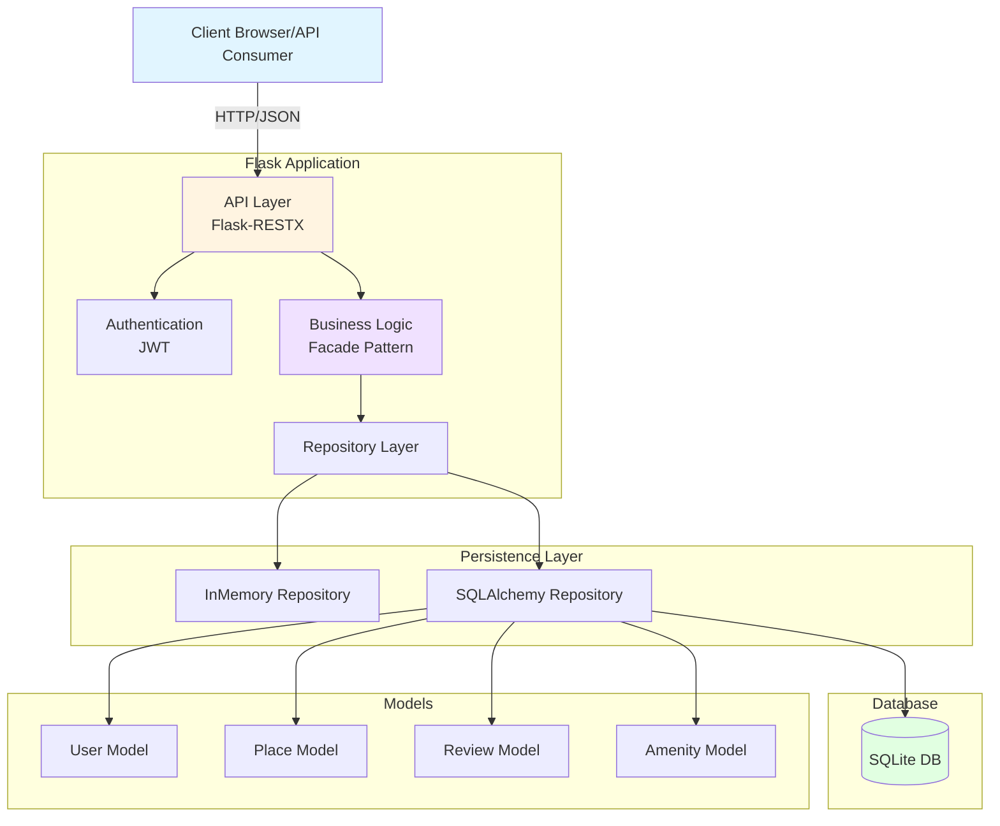
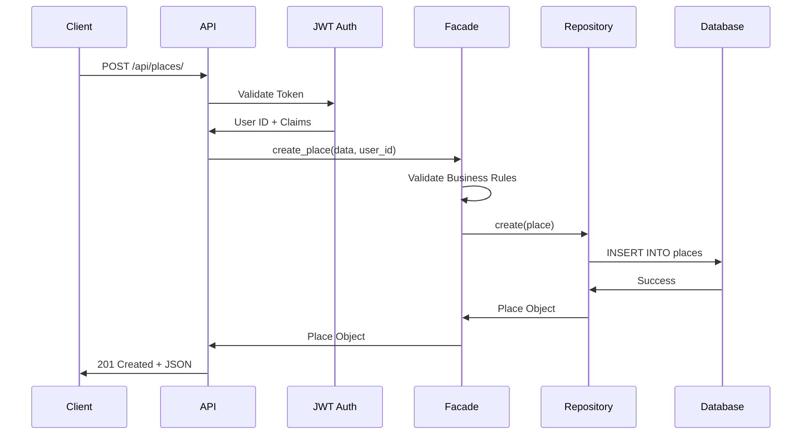

# HBnB Application Architecture

## System Architecture Diagram

## Architecture Layers

### 1. API Layer (Flask-RESTX)
- RESTful endpoints
- Request validation
- Response formatting
- Swagger documentation

### 2. Authentication Layer (JWT)
- Token generation
- Token validation
- Role-based access control
- Password hashing (Bcrypt)

### 3. Business Logic Layer (Facade)
- Business rules
- Validation logic
- Orchestration
- Repository coordination

### 4. Repository Layer
- Abstraction over data access
- Switchable implementations
- CRUD operations

### 5. Persistence Layer
- InMemory (for testing)
- SQLAlchemy (for production)

### 6. Database Layer
- SQLite (development)
- MySQL/PostgreSQL (production)

## Data Flow
