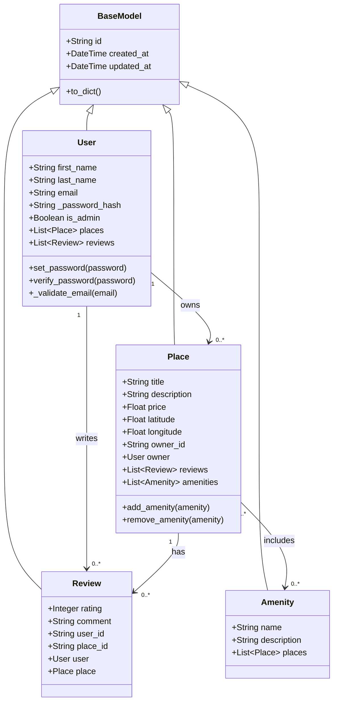

# HBnB Class Diagram - SQLAlchemy Models

## Class Structure


## Inheritance

All models inherit from `BaseModel` which provides:
- Unique ID generation (UUID)
- Automatic timestamps (created_at, updated_at)
- Common serialization method (to_dict)

## Relationships in SQLAlchemy

### One-to-Many (with backref)
```python
# User → Places
places = db.relationship('Place', backref='owner', cascade='all, delete-orphan')

# User → Reviews
reviews = db.relationship('Review', backref='user', cascade='all, delete-orphan')

# Place → Reviews
reviews = db.relationship('Review', backref='place', cascade='all, delete-orphan')
```

### Many-to-Many (with association table)
```python
# Place ↔ Amenities
amenities = db.relationship('Amenity', secondary='place_amenity', 
                           back_populates='places')
places = db.relationship('Place', secondary='place_amenity', 
                        back_populates='amenities')
```