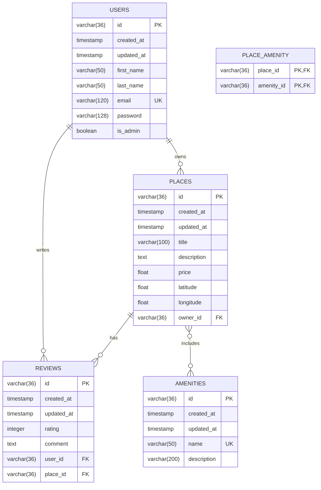

# HBnB Database Schema - Entity Relationship Diagram

## Complete Database Schema

## Relationships Explained

### One-to-Many Relationships

1. **USERS → PLACES** (One-to-Many)
   - One user can own many places
   - Each place belongs to one user
   - Foreign Key: `places.owner_id` → `users.id`
   - Cascade: ON DELETE CASCADE

2. **USERS → REVIEWS** (One-to-Many)
   - One user can write many reviews
   - Each review belongs to one user
   - Foreign Key: `reviews.user_id` → `users.id`
   - Cascade: ON DELETE CASCADE

3. **PLACES → REVIEWS** (One-to-Many)
   - One place can have many reviews
   - Each review belongs to one place
   - Foreign Key: `reviews.place_id` → `places.id`
   - Cascade: ON DELETE CASCADE

### Many-to-Many Relationship

4. **PLACES ↔ AMENITIES** (Many-to-Many)
   - One place can have many amenities
   - One amenity can be in many places
   - Junction Table: `place_amenity`
   - Foreign Keys:
     - `place_amenity.place_id` → `places.id`
     - `place_amenity.amenity_id` → `amenities.id`
   - Cascade: ON DELETE CASCADE

## Constraints

### Primary Keys
- All tables use UUID (VARCHAR(36)) as primary key
- `place_amenity` uses composite primary key (place_id, amenity_id)

### Unique Constraints
- `users.email` - Ensures unique email addresses
- `amenities.name` - Ensures unique amenity names

### Check Constraints
- `reviews.rating` - Must be between 1 and 5

### Not Null Constraints
- Most fields are NOT NULL to ensure data integrity
- Optional fields: `places.description`, `places.latitude`, `places.longitude`, `amenities.description`

## Indexes

### Performance Indexes
- `idx_users_email` on `users(email)` - Fast email lookups
- `idx_places_owner` on `places(owner_id)` - Fast owner queries
- `idx_reviews_user` on `reviews(user_id)` - Fast user review queries
- `idx_reviews_place` on `reviews(place_id)` - Fast place review queries
- `idx_amenities_name` on `amenities(name)` - Fast amenity lookups
- `idx_place_amenity_place` on `place_amenity(place_id)`
- `idx_place_amenity_amenity` on `place_amenity(amenity_id)`
