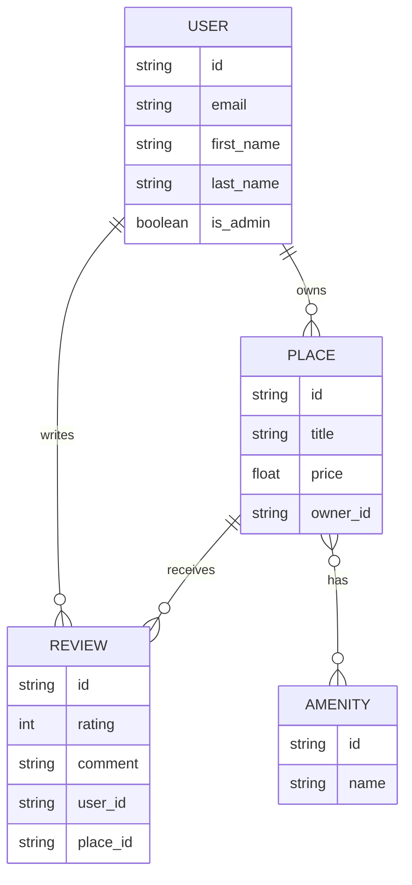

# HBnB Database - Simplified View

## Entity Relationship Diagram (Simplified)

## Legend

- `||--o{` : One-to-Many relationship
- `}o--o{` : Many-to-Many relationship
- PK: Primary Key
- FK: Foreign Key
- UK: Unique Key
